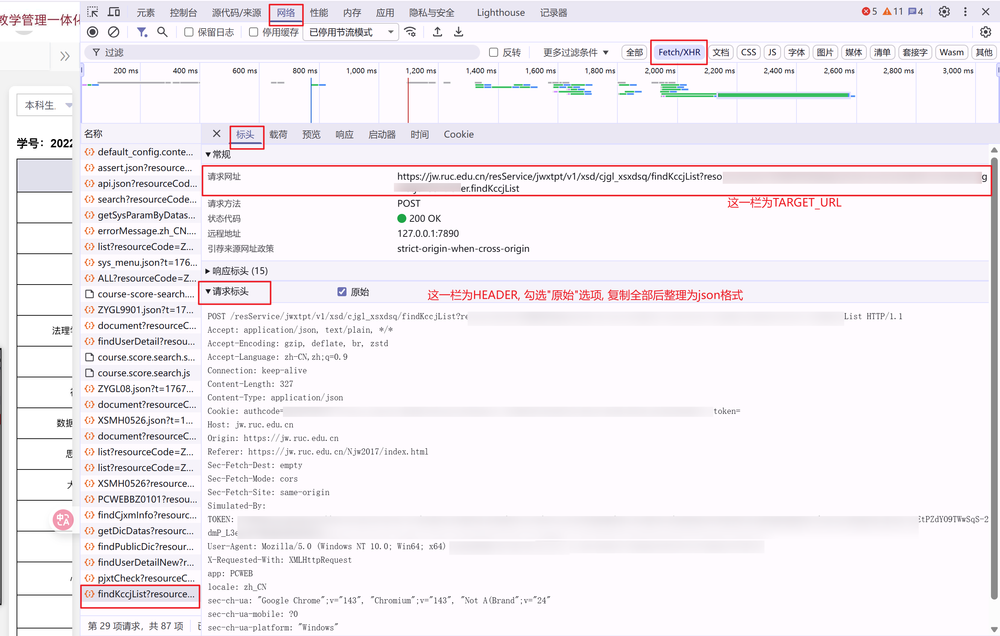
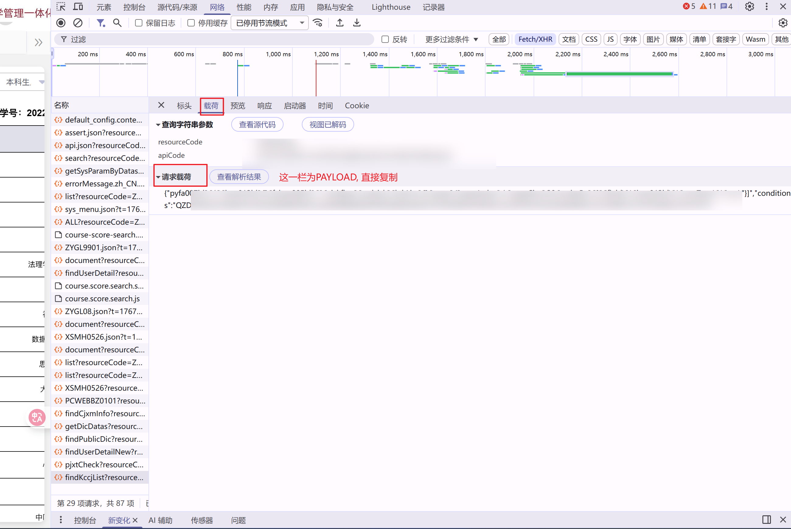

# RUC成绩出分推送
实时监控成绩系统，将更新实时推送至微信/邮箱

### 部署
```
git clone https://github.com/lyc289/RUC-Course-Score.git
cd RUC-Course-Score
pip install requests
```
将`example_config.py`复制为`config.py`，并填写其中的配置项


**配置获取方法**：


见`config.py`，需要三个参数`TARGET_URL`(str格式), `HEADERS`(json格式), `PAYLOAD`(json格式)

如图，在成绩单页面按F12进入开发者页面，进入“网络”选项卡，选择"Fetch/XHR"过滤条件
刷新页面，网页加载完毕后左侧名称栏中寻找“findFccjList”开头的请求并点开
在“标头”选项中，可以找到TRAGET_URL和HEADER；

如图，切换至“载荷”选项卡，复制PAYLOAD


### 运行


完成配置后，在终端运行
`python main.py`
推荐的做法是挂到后台:
```
# 使用tmux
tmux new -s score
tmux a -t score
python main.py
```
好处是不会受前台终端关闭的影响，可以一直保持运行